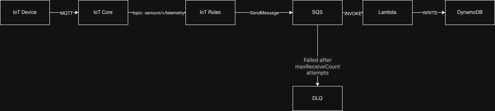

# UC02 — Decoupled Edge Ingestion

> Ingest IoT telemetry with durable buffering — no message loss even when downstream fails.

**Services:** IoT Core · IoT Rules · SQS · Lambda · DynamoDB  
**Pattern:** Durable buffering / decoupling

---

## 1. Problem

IoT devices send telemetry continuously, but downstream systems (Lambda, databases) can fail or become temporarily unavailable. A direct IoT Core → Lambda integration is fire-and-forget: if Lambda fails mid-processing or the database is down, the message is lost forever.

At scale, you also face traffic spikes — thousands of devices reporting simultaneously after a network outage. Without buffering, these bursts can overwhelm Lambda concurrency limits, causing throttling and data loss.

**What we need:** A buffer that holds messages until they're successfully processed, retries on failure, and quarantines messages that can never succeed.


## 2. Why This Pattern

**SQS over direct Lambda invocation:**
- Without SQS (direct invocation): if Lambda fails, the message is lost forever
- With SQS: if Lambda fails, the message stays in the queue and is retried automatically
- Absorbs traffic spikes — queue buffers messages while Lambda scales to drain them
- Decouples producer (IoT Rule) and consumer (Lambda) — they don't need to be available simultaneously
- Trade-off: adds ~10-100ms latency compared to direct invocation

**DLQ (Dead Letter Queue):**
- Without DLQ: A malformed message (e.g., `{"temp": "not-a-number"}`) fails forever. Lambda retries, fails, retries... blocking the queue.
- With DLQ: After N failures (configured via `maxReceiveCount`), message moves to DLQ. Main queue continues processing. You can later inspect, fix, and replay failed messages.

**DynamoDB over Timestream:**
- Timestream requires AWS account enablement (blocked for new accounts)
- DynamoDB: key-value store, good for lookups like "get latest reading by device_id"
- Trade-off: DynamoDB isn't optimized for time-range aggregations like "average temperature over last hour" — you'd need to scan and compute in application code


## 3. How It Works



**Data flow (happy path):**

1. **IoT Device** publishes MQTT message to IoT Core
   - Topic: `sensors/{device_id}/telemetry`
   - Payload: `{"temperature": 25.3, "humidity": 60}`

2. **IoT Rule** matches the topic pattern and sends message to **SQS**
   - Rule SQL: `SELECT *, topic(2) AS device_id FROM 'sensors/+/telemetry'`
   - Adds `device_id` extracted from topic path

3. **SQS** holds the message until Lambda processes it
   - Message becomes invisible during processing (visibility timeout)
   - If Lambda succeeds, message is deleted
   - If Lambda fails, message reappears after timeout for retry

4. **Lambda** (triggered by SQS) processes the message
   - Extracts `device_id`, `temperature`, `humidity`
   - Writes to DynamoDB with idempotent key (`device_id#timestamp`)

5. **DynamoDB** stores the telemetry record
   - Partition key: `device_id`
   - Sort key: `timestamp`
   - Enables queries like "get all readings for sensor-001"

**Failure path:**

6. If Lambda fails **3 times** (configurable `maxReceiveCount`), SQS moves the message to the **DLQ**
   - DLQ holds failed messages for inspection
   - You can replay them after fixing the issue


## 4. Trade-offs

| Trade-off | Implication |
|-----------|-------------|
| **Added latency** | SQS adds ~10-100ms vs direct invocation. Not suitable for real-time alerting (use UC04 for that). |
| **At-least-once delivery** | Messages may be delivered more than once. Lambda must be idempotent — use unique keys in DynamoDB to prevent duplicates. |
| **DLQ requires monitoring** | Failed messages sit in DLQ until you act. Set up CloudWatch alarms on DLQ depth, or messages rot there unnoticed. |
| **No time-series optimization** | DynamoDB is a key-value store, not a time-series DB. Aggregations like "avg over last hour" require application-level scans. |
| **Standard SQS ordering** | Messages may arrive out of order. If strict ordering matters, use FIFO queue (but lower throughput). |

**When NOT to use this pattern:**
- You need sub-100ms end-to-end latency → use direct invocation (UC01/UC04)
- You need strict message ordering → use FIFO SQS or Kinesis
- You need time-range aggregations → use Timestream (when available) or a time-series DB

---

## 5. Cost

| Service | Pricing | Free Tier |
|---------|---------|-----------|
| IoT Core | ~$1 per 1M messages | 250K messages/month (12 months) |
| SQS | $0.40 per 1M requests | 1M requests/month |
| Lambda | $0.20 per 1M invocations + compute | 1M requests/month |
| DynamoDB | $1.25 per 1M writes, $0.25 per 1M reads | 25 WCU/RCU, 25GB storage |

**Estimate at 10,000 messages/day:**
- All services within Free Tier for first year
- **Total: ~$0/month** if destroyed promptly

**Teardown:**
```bash
terraform destroy
```

## 6. Deploy & Test

```bash
cd terraform/
terraform init
terraform plan
terraform apply
```

**Test — publish a message:**

```bash
aws iot-data publish \
  --topic "sensors/test-device/telemetry" \
  --payload '{"temperature": 25.3, "humidity": 60}' \
  --cli-binary-format raw-in-base64-out \
  --region eu-west-1
```

> **Note:** The `--cli-binary-format raw-in-base64-out` flag is required for AWS CLI v2, which defaults to base64-encoded payloads.

**Verify in DynamoDB:**

```bash
aws dynamodb scan \
  --table-name uc02-iot-telemetry \
  --region eu-west-1
```

**Destroy:**

```bash
terraform destroy
```